<h1 align="center">Shot Share</h1>

<p align="center">
  A community photo-sharing and blogging platform built with PHP, MySQL and vanilla JavaScript.
</p>

<p align="center">
  
  
  
  
  
  
</p>

<p align="center">
  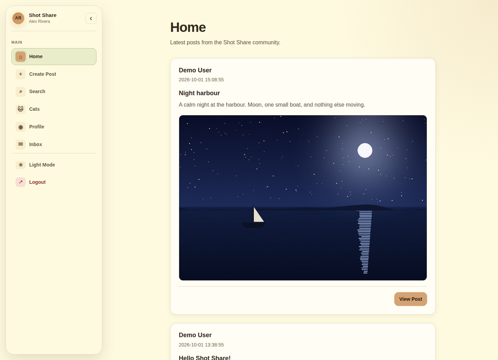
</p>

## Overview

Shot Share lets signed-in members publish posts with an optional JPG/PNG image, browse a newest-first feed, filter posts with instant search, like and comment on posts, and receive a notification in their inbox when someone interacts with their content. A Cats page loads random images from [The Cat API](https://thecatapi.com/) through a same-origin PHP proxy.

The project uses plain PHP with PDO, a relational MySQL/MariaDB schema, hand-written CSS with light and dark themes, and vanilla JavaScript. There is no framework and no build step.

It was developed as the course project for **ITCS 333 — Internet Software Development** at the **University of Bahrain**.

## Application Preview

> Screenshots were captured from the running application using fictional demo accounts and generated placeholder images.

<table>
  <tr>
    <td width="50%">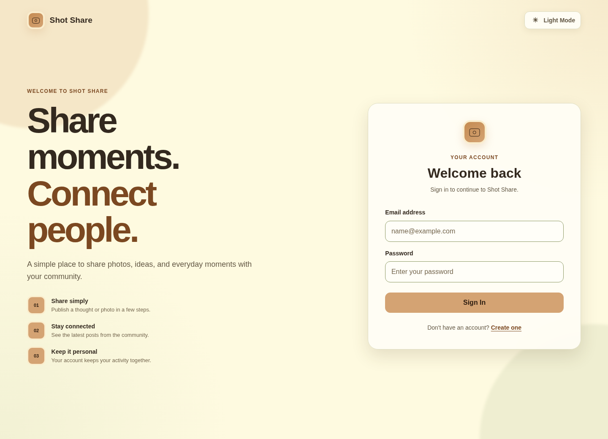</td>
    <td width="50%">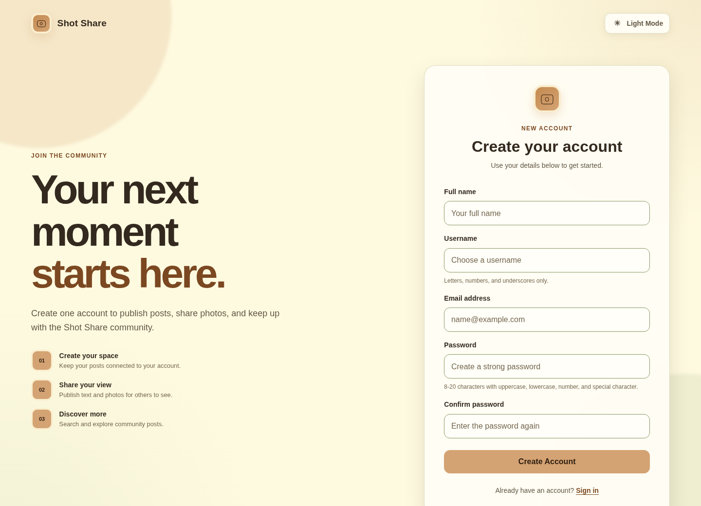</td>
  </tr>
  <tr>
    <td align="center"><sub><b>Login</b></sub></td>
    <td align="center"><sub><b>Registration</b> with server-side validation</sub></td>
  </tr>
  <tr>
    <td width="50%">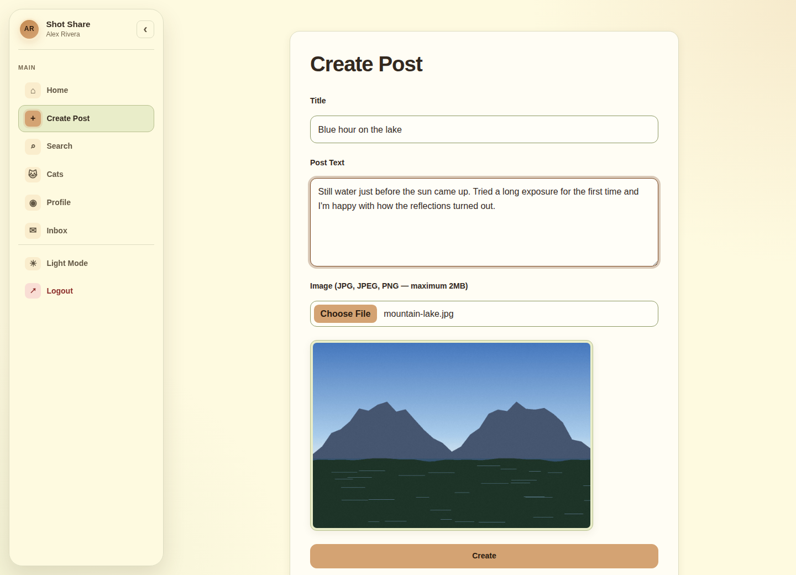</td>
    <td width="50%">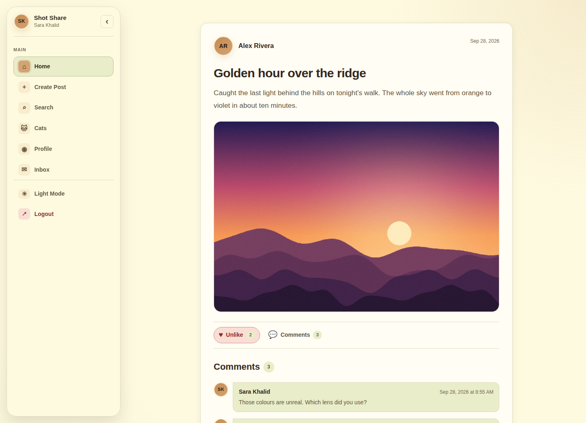</td>
  </tr>
  <tr>
    <td align="center"><sub><b>Create Post</b> with image upload and live preview</sub></td>
    <td align="center"><sub><b>Post details</b> with likes and comments</sub></td>
  </tr>
  <tr>
    <td width="50%">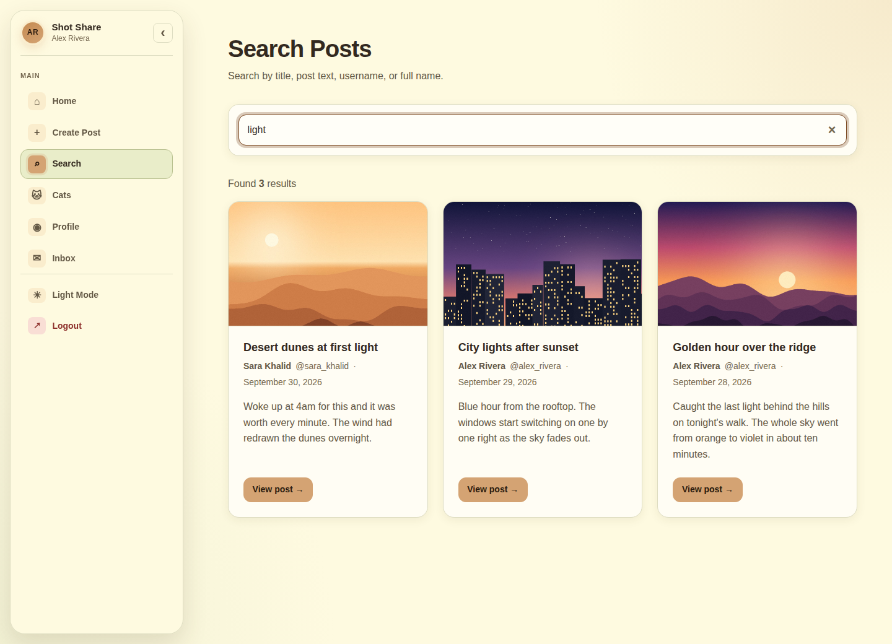</td>
    <td width="50%">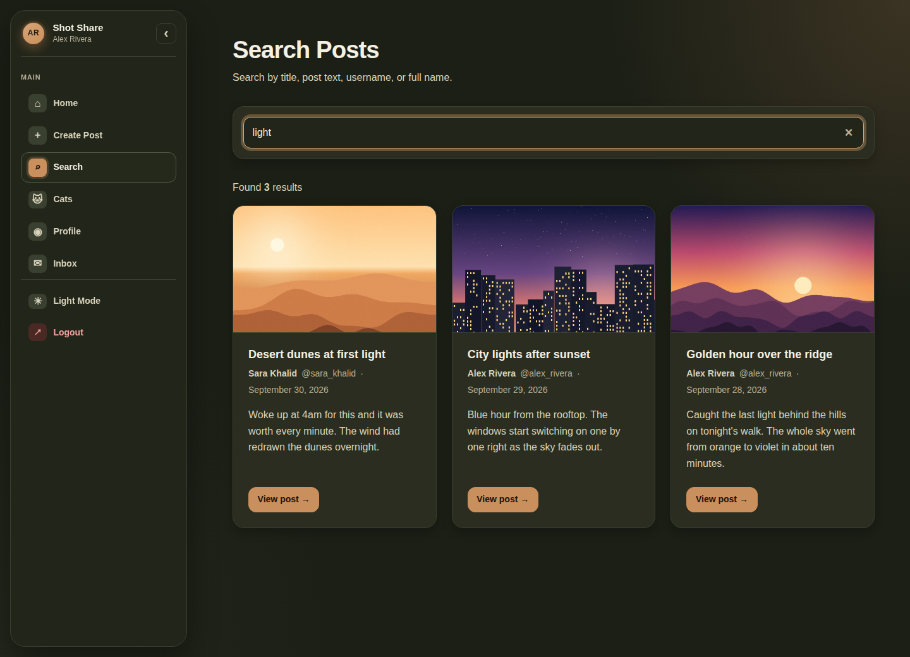</td>
  </tr>
  <tr>
    <td align="center"><sub><b>Search</b> filters the feed as you type</sub></td>
    <td align="center"><sub><b>Dark theme</b> (preference saved in localStorage)</sub></td>
  </tr>
  <tr>
    <td width="50%">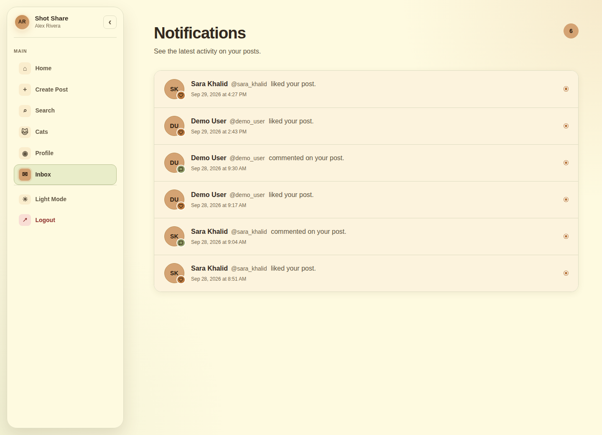</td>
    <td width="50%">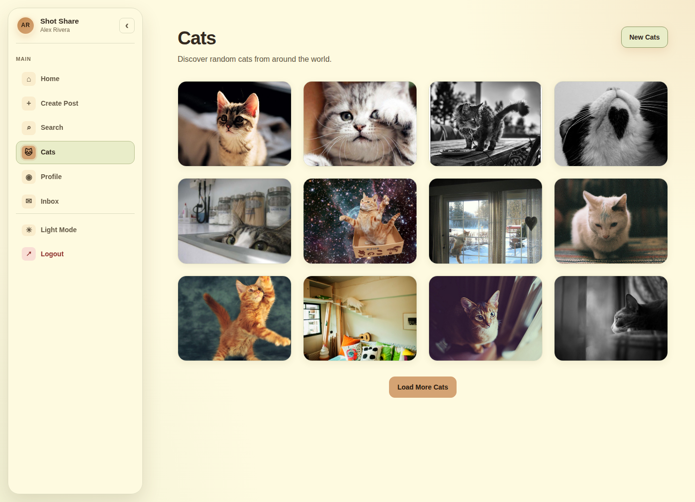</td>
  </tr>
  <tr>
    <td align="center"><sub><b>Inbox</b> notifications for likes and comments</sub></td>
    <td align="center"><sub><b>Cats</b> gallery via the PHP proxy</sub></td>
  </tr>
</table>

<p align="center">
  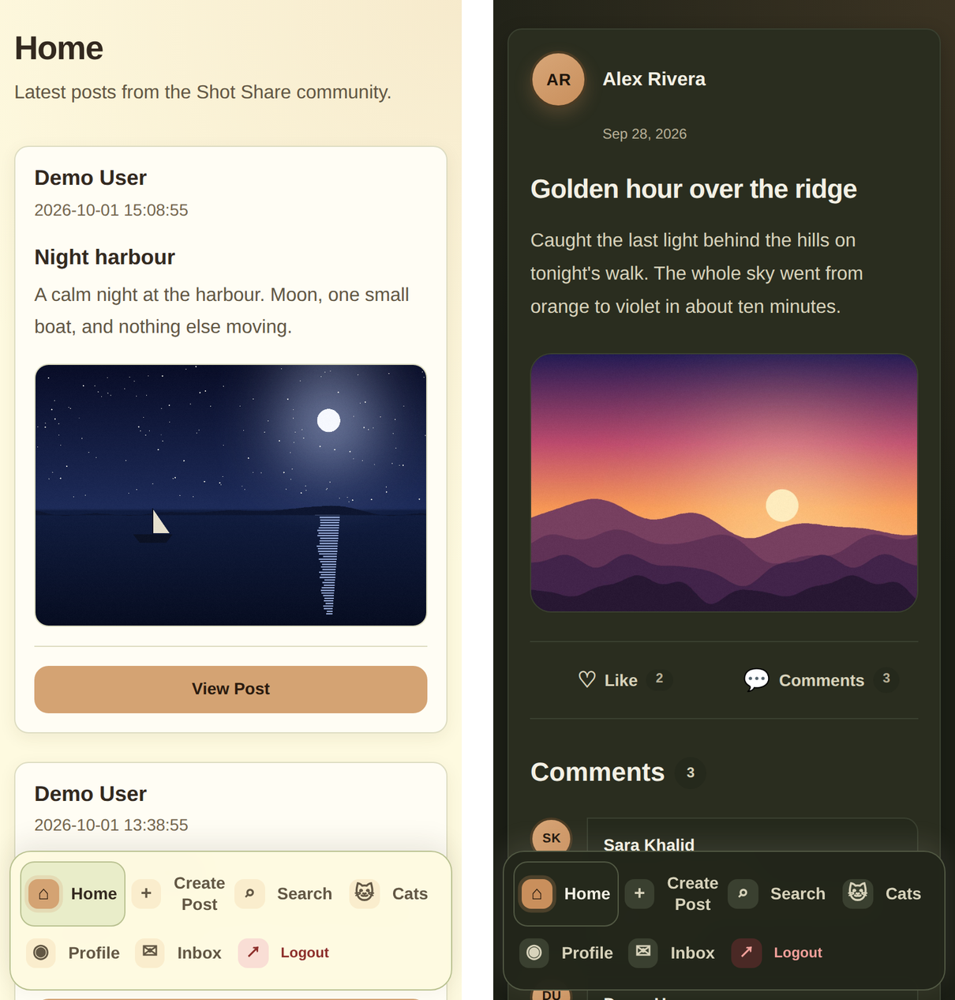
  <br>
  <sub><b>Mobile layout</b> — sidebar becomes a bottom navigation bar at 768&nbsp;px and below</sub>
</p>

## Features

**Accounts**
- Registration with server-side validation of name, username, email and password strength; duplicate emails and usernames are rejected
- Login and logout with session-based authentication
- Profile settings: change full name, username and password (the current password is required)

**Content**
- Create posts with a title, text and an optional JPG/PNG image (max 2 MB) with a live preview before upload
- Home feed of all posts, newest first
- Post detail page; post owners can delete their own posts after a confirmation prompt

**Community**
- Like / unlike toggle and comments on every post
- Inbox showing a notification when another user likes or comments on your post
- Search by title, post text, username or full name, filtered instantly in the browser

**Experience**
- Light and dark themes (follows the OS setting until a choice is saved)
- Collapsible desktop sidebar whose state is remembered
- Responsive layout down to phone width
- Cats gallery with loading skeletons, error retry and "Load More"

## Tech Stack

| Layer | Technologies |
|---|---|
| Frontend | HTML5 (server-rendered by PHP), hand-written CSS3 with custom properties, vanilla JavaScript (`fetch`, `localStorage`, `FileReader`) |
| Backend | PHP — sessions, `password_hash`, file uploads with `finfo` MIME detection, cURL |
| Data access | PDO (`pdo_mysql`) with prepared statements |
| Database | MySQL / MariaDB, InnoDB, `utf8mb4` |
| External API | [The Cat API](https://thecatapi.com/), accessed only from `api/cats.php` |
| Web server | Apache (XAMPP) |
| Tools | XAMPP, Git, GitHub |

The SCSS files in `style-beta/` are design references only. There is no Sass build step; their values are mirrored by hand in `assets/css/style.css`.

## How It Works

1. Every page except the auth screens is requested through `index.php?page=<name>`.
2. `index.php` starts the session and redirects anonymous visitors to `auth/login.php`.
3. The `page` value is looked up in a fixed route map (an allow-list). A match is `require`d inside the shared sidebar layout; anything else returns HTTP 404 and renders `pages/not-found.php`.
4. Actions that change data (like, comment, delete) are small POST-only endpoints that validate input, run prepared statements and redirect back.
5. The Cats page calls `api/cats.php` with `fetch()`; the PHP endpoint calls The Cat API server-side and returns a trimmed JSON payload.

## Architecture

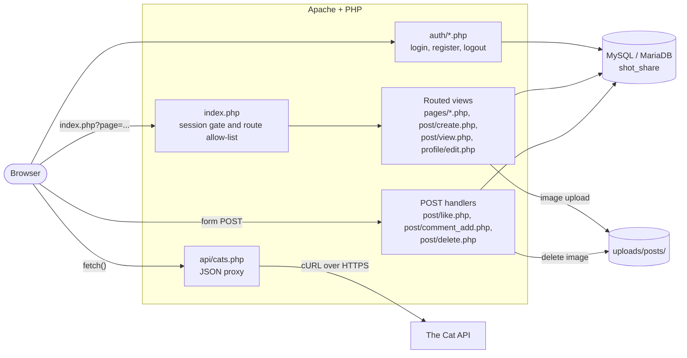

### Routes

| `?page=` | File | Purpose |
|---|---|---|
| `home` | `pages/home.php` | Global feed |
| `create-post` | `post/create.php` | New post form and upload handling |
| `view-post` | `post/view.php` | Post details, likes, comments (`&post_id=`) |
| `search` | `pages/search.php` | Search page |
| `cats` | `pages/cat.php` | Cats gallery |
| `inbox` | `pages/inbox.php` | Notifications |
| `profile_edit` | `profile/edit.php` | Profile settings (the sidebar's "Profile" link) |
| *anything else* | `pages/not-found.php` | HTTP 404 |

`auth/*.php`, `post/like.php`, `post/comment_add.php`, `post/delete.php` and `api/cats.php` are requested directly rather than through the router.

## Database Design

`database/schema.sql` creates the `shot_share` database (`utf8mb4`, InnoDB) and five tables.

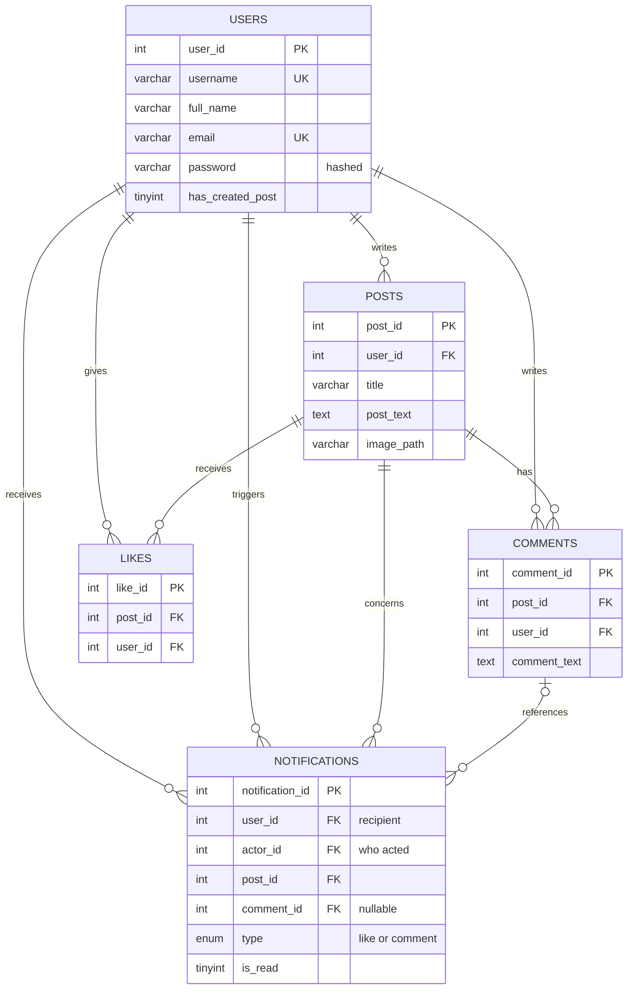

| Table | Purpose |
|---|---|
| `users` | Accounts: unique username and email, bcrypt password hash, and a `has_created_post` flag that controls the sidebar "Share a moment" prompt |
| `posts` | A post's author, title, text, optional image path (relative to the project root) and timestamp |
| `comments` | Comments attached to a post |
| `likes` | One row per user per post while the post is liked; removed on un-like |
| `notifications` | Recipient, actor, post, optional comment, type (`like` / `comment`) and read flag |

Every foreign key is `ON DELETE CASCADE`. This was checked against a running MariaDB instance: deleting a post also removed its likes, comments and notifications. `users.photo_url` exists in the schema but is not used by the application.

## Technical Highlights

- **Route allow-list.** `index.php` maps page names to files through an array, so request input is never used to build an include path. Unknown pages, `pages/home` and `../database/db_connect` all return 404.
- **Prepared statements throughout.** All database access goes through PDO with `ERRMODE_EXCEPTION` and `ATTR_EMULATE_PREPARES => false`. The codebase has no `query()`, `exec()` or `mysqli_*` calls.
- **Password handling.** Passwords are stored with `password_hash()` (bcrypt) and checked with `password_verify()`. Login calls `session_regenerate_id(true)` to prevent session fixation.
- **Upload validation.** `post/create.php` detects the real MIME type with `finfo`, accepts only JPEG and PNG, enforces a 2 MB limit, ignores the client-supplied filename and stores the file as `post_<32 hex chars>.<ext>`. If the database insert fails, the saved file is removed.
- **Ownership checks.** Deleting a post uses `WHERE post_id = ? AND user_id = ?` and only accepts POST; a request for someone else's post gets a 404 and the post is left untouched. The attached image is then deleted from `uploads/posts/`, using only the basename of the stored path.
- **Output escaping.** User-generated content in the feed, post view, search results and inbox is passed through `htmlspecialchars()`. A post whose title and body contained `<script>` and `` markup rendered as plain text.
- **Notification logic.** Likes and comments create a notification only when the actor is not the post owner.
- **Same-origin API proxy.** `api/cats.php` requires a session, accepts only GET, validates `limit` (1–20), applies connect/total timeouts, validates each upstream URL, returns only `id`, `url`, dimensions and optional breed, and replies with a generic 502 on upstream failure while logging details server-side.
- **Design tokens and themes.** `assets/css/style.css` defines colours, spacing, radii and typography as CSS custom properties, with light and dark sets selected by `data-theme` or `prefers-color-scheme`. The choice and the sidebar state persist in `localStorage`.
- **Accessibility touches.** Skip link, `aria-current` on the active navigation item, `aria-live` regions for search and gallery status, and `prefers-reduced-motion` / `prefers-contrast` styles.
- **Responsive breakpoints.** Layout adjustments at 1024, 896, 768, 640, 576 and 480 px; at 768 px and below the sidebar becomes a fixed bottom navigation bar.

## Security Considerations

This is a course project and has not had a formal security review. The mechanisms listed under *Technical Highlights* are what the code implements: prepared statements, password hashing, session regeneration on login, server-side validation, upload checks, ownership checks and output escaping. The gaps below are known.

## Known Limitations

- **Search results link to the wrong parameter.** `pages/search.php` links to `view-post&id=<n>` but the post page reads `post_id`, so opening a post from the Search page shows "Invalid Post ID". Posts open correctly from the Home feed and the Inbox.
- **Search is client-side.** Search renders every post and filters them in the browser; it does not query the database.
- **Notifications are never marked read.** `is_read` is never updated, so every notification keeps its unread indicator. Un-liking a post also inserts a new "like" notification.
- **No CSRF tokens** on the like, comment, delete and profile forms.
- **Likes are not constrained in the database.** There is no `UNIQUE (post_id, user_id)` on `likes`; one like per user relies on the toggle in `post/like.php`.
- **Unescaped output on the profile page.** `profile/edit.php` prints the current name, username and email without `htmlspecialchars()`.
- **Cat API key is hard-coded** in `api/cats.php`. The API also answers anonymous requests, so replace or rotate the key and load it from the server environment before any public deployment. `docs/CATS_FEATURE.md` still describes an older environment-variable approach.
- **404 page links.** The "Back to Home" and "Search Posts" buttons use hard-coded relative URLs that do not resolve to the right routes.
- **Theme toggle.** With no saved preference, its label shows the opposite of the active theme until it is clicked once, and it is hidden at 768 px and below (the theme then follows the OS setting).
- **No public profile page.** `pages/profile.php` is an empty placeholder and is not routed; avatars are initials.

## Project Structure

```text
shot_share/
├── index.php                  # Session gate, route allow-list, sidebar layout
├── auth/
│   ├── login.php              # Sign in (standalone page)
│   ├── register.php           # Sign up with server-side validation
│   └── logout.php             # Destroys the session
├── pages/
│   ├── home.php               # Global feed, newest first
│   ├── search.php             # Search page (filtering done in search.js)
│   ├── inbox.php              # Like / comment notifications
│   ├── cat.php                # Cats gallery markup
│   ├── not-found.php          # 404 view
│   └── profile.php            # Empty placeholder (not routed)
├── post/
│   ├── create.php             # Create post and validated image upload
│   ├── view.php               # Post details, likes, comments
│   ├── delete.php             # Owner-only delete (POST)
│   ├── like.php               # Like / unlike toggle (POST)
│   └── comment_add.php        # Add comment (POST)
├── profile/
│   └── edit.php               # Edit name, username, password
├── api/
│   └── cats.php               # Session-protected JSON proxy to The Cat API
├── database/
│   ├── db_connect.php         # PDO connection settings
│   └── schema.sql             # Database and table definitions
├── assets/
│   ├── css/style.css          # Design tokens, themes, responsive layout
│   └── js/                    # main.js, search.js, cat.js, image-preview.js,
│                              # delete-confirmation.js, login.js
├── uploads/posts/             # Uploaded post images
├── style-beta/                # SCSS palettes and HTML design prototypes
└── docs/                      # Feature notes, course spec, screenshots
```

## Getting Started

### Requirements

- [XAMPP](https://www.apachefriends.org/) (Apache + MySQL/MariaDB + PHP), or any equivalent stack
- PHP with the `pdo_mysql`, `mbstring`, `fileinfo`, `curl` and `json` extensions (all enabled in a default XAMPP install)
- A modern web browser
- Internet access for the Cats page only

The project was verified with PHP 8.2.4 and MariaDB 10.4.28 (the versions bundled with XAMPP 8.2.4). The code uses `JSON_THROW_ON_ERROR`, so PHP 7.3 is the lowest version it can run on; no PHP 8-only syntax was found, but older versions were not tested.

### 1. Get the code

Clone the repository into XAMPP's web root (`C:\xampp\htdocs` on Windows, `/opt/lampp/htdocs` on Linux, `/Applications/XAMPP/xamppfiles/htdocs` on macOS):

```bash
cd /path/to/xampp/htdocs
git clone https://github.com/hussainhht/shot_share.git
```

### 2. Start the services

Start **Apache** and **MySQL** from the XAMPP Control Panel.

### 3. Import the database

`database/schema.sql` creates the `shot_share` database and all tables, so you do not need to create the database first.

- **phpMyAdmin:** open `http://localhost/phpmyadmin`, choose **Import**, select `database/schema.sql`, and click **Go**.
- **Command line:** from the project folder run

  ```bash
  mysql -u root < database/schema.sql
  ```

  (use `C:\xampp\mysql\bin\mysql.exe` on Windows or `/opt/lampp/bin/mysql` on Linux if `mysql` is not on your `PATH`)

### 4. Check the database settings

Connection settings live in [`database/db_connect.php`](database/db_connect.php). The defaults match a stock XAMPP install:

```php
$host = 'localhost';
$database = 'shot_share';
$user = 'root';
$db_password = '';
```

Change them if your MySQL setup differs, and never commit real credentials.

### 5. Open the app

Visit **http://localhost/shot_share/**. You will be redirected to the login page; choose **Create one** to register.

Uploaded images are written to `uploads/posts/` (created automatically if missing). On Linux and macOS make sure the web server user can write to it.

> **Without Apache:** if PHP can already reach your MySQL/MariaDB server as `localhost` and the database is imported, you can serve the project from its root with `php -S localhost:8000` and open `http://localhost:8000/`.

## Usage

1. **Register** a new account. Usernames use letters, numbers and underscores (3–50 characters). Passwords must be 8–20 characters with an uppercase letter, a lowercase letter, a number and one of `@#$!%*_?&`.
2. **Create a post** from the sidebar, optionally attaching a JPG or PNG image of up to 2 MB.
3. **Open a post** from the Home feed to like it or comment on it. Post owners see a **Delete Post** button.
4. **See notifications:** register a second account (a private browser window works well), like or comment on the first account's post, then open **Inbox** as the first user.
5. **Search** from the sidebar; results update as you type.
6. **Cats** shows random images; **New Cats** replaces the set and **Load More Cats** appends more.
7. Use the sidebar button to switch between light and dark themes, or the arrow in the sidebar header to collapse it.

## Team & Contributions

| Contributor | Main areas (from Git history) |
|---|---|
| [Hussain Ali H. Ali](https://github.com/hussainhht) | Project setup and planning documents; database schema (including the notifications table); `index.php` router and sidebar layout; Home feed; Search page and client-side filter; shared stylesheet with light/dark themes and responsive layout (`style.css`, `main.js`, SCSS palettes); Cats gallery and API proxy; notifications and Inbox; 404 page; restyled login/register pages; reworked the post create/view/delete pages |
| [Abdulaziz Hassan](https://github.com/AbdulazizHassan03) | First versions of post creation, post details and post deletion; image preview and delete-confirmation scripts; post titles; comment system; like system |
| [Yusef](https://github.com/yalkhedri0) | Registration with validation, duplicate checks and password hashing; login, logout and session handling; the original database connection file; Edit Profile page (name, username, password change) |

Contribution descriptions were derived from the repository's Git history (commit authorship, files changed and `git blame`) and the project's documentation. Commits appear under the Git identities `hussainali7`, `AbdulazizHassan03` and `yalkhedri0`. [`docs/TEAM_WORK_DISTRIBUTION.md`](docs/TEAM_WORK_DISTRIBUTION.md) is the original plan, which splits the work into three numbered roles rather than named people.

## Course Information

| | |
|---|---|
| **Course** | ITCS 333 — Internet Software Development |
| **University** | University of Bahrain |
| **Development period** | 30 July – 7 August 2026 (from Git history) |

## Documentation

- [`docs/CATS_FEATURE.md`](docs/CATS_FEATURE.md) — Cats gallery and API proxy notes (its API-key section predates the current `api/cats.php`)
- [`docs/STYLE_IMPLEMENTATION.md`](docs/STYLE_IMPLEMENTATION.md) — colour system, theming and responsive breakpoints (refers to the SCSS files by their former `style/` path; they now live in `style-beta/`)
- [`docs/TEAM_WORK_DISTRIBUTION.md`](docs/TEAM_WORK_DISTRIBUTION.md) — original three-person work plan
- [`docs/Project.pdf`](docs/Project.pdf) — course project specification
